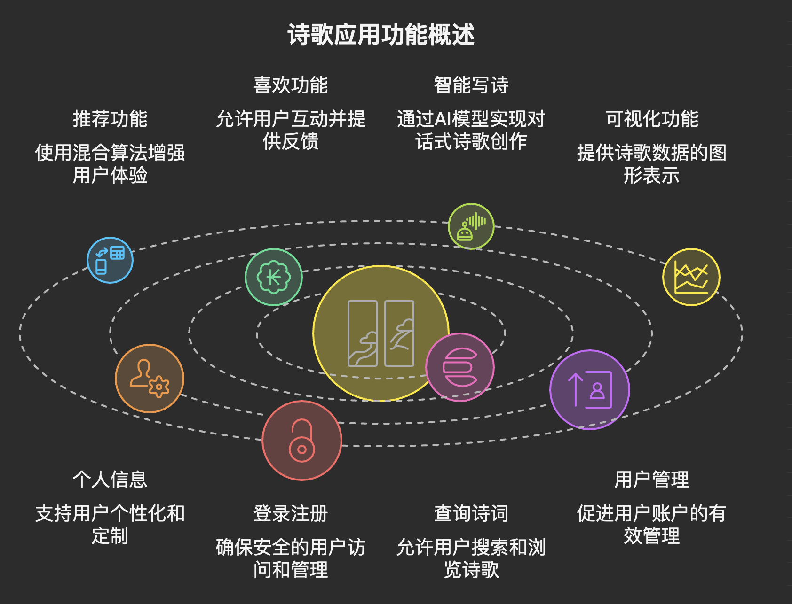
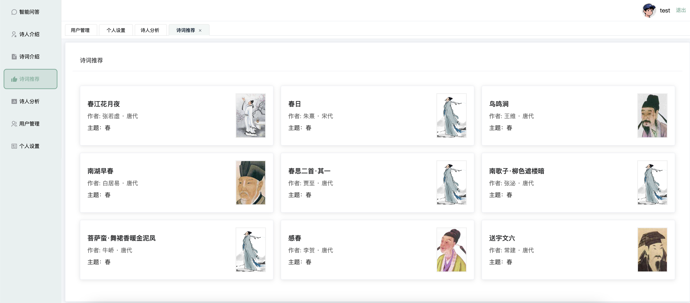

>               文章结尾部分有CSDN官方提供的学长 联系方式名片
>               文章结尾部分有CSDN官方提供的学长 联系方式名片
>                              关注B站，有好处！

编号： F061
## 大模型诗词推荐与可视化系统
在传统文化数字化的浪潮下，我开发了这款诗歌问答大数据平台，旨在通过现代技术赋能古典诗词学习与传播。平台不仅实现了诗词数据的系统化管理，更融合了AI推荐、可视化分析等智能化功能。本文将重点介绍平台的核心功能模块，分享技术实现思路与功能亮点。
### 技术架构
vue+flask+mysql+llm
### 功能说明


## 功能介绍
1.推荐功能：混合推荐算法【基于内容的推荐+协同过滤+冷启动】
协同过滤：结合用户点赞行为，挖掘兴趣相似用户群体的偏好；


```python
def hybrid_recommend(user_id, top_n=10):
    """
    混合推荐函数，结合基于内容的推荐、协同过滤推荐和热门推荐。

    :param user_id: 用户的 ID，用于获取用户的点赞记录。
    :param top_n: 推荐的诗歌数量，默认为 10。
    :return: 推荐的诗歌 ID 列表。
    """
    # 获取指定用户的点赞记录，仅提取诗歌 ID
    user_likes = UserLike.query.filter_by(user_id=user_id).with_entities(UserLike.poem_id).all()
    # 将查询结果转换为包含诗歌 ID 的列表
    user_likes = [like.poem_id for like in user_likes]

        # 若用户没有点赞记录，调用热门推荐函数，返回热门诗歌的 ID 列表
        # 打印联合推荐结果
        # 合并基于内容和协同过滤的推荐结果，去除重复项，并截取前 top_n 个
        # 调用协同过滤推荐函数，获取推荐的诗歌 ID 列表
        # 若用户有点赞记录，调用基于内容的推荐函数，获取推荐的诗歌 ID 列表

    # 检查用户是否有点赞记录
    # 打印调试信息，可注释掉这行以避免输出过多信息
    # 调用 extract_features 函数，提取所有诗歌的 ID、文本特征和类别特征
    poem_ids, text_features, category_features = extract_features()
    # print(poem_ids, text_features, category_features)
    if user_likes:
        content_based_rec = content_based_recommend(user_likes, poem_ids, text_features, category_features, top_n)
        collaborative_rec = collaborative_filtering_recommend(user_id, top_n)
        combined_rec = list(set(content_based_rec + collaborative_rec))[:top_n]
        print('联合推荐:', combined_rec)
        return combined_rec
    else:
        return popular_recommend(top_n)
```

2.喜欢功能：这个和结合推荐一起用的，可以点击喜欢诗词点赞/取消点赞
用户可对喜爱的诗词进行 点赞/取消点赞，操作数据实时反馈至推荐引擎；


3.智能写诗：基于硅基流动的模型接口实现对话写诗
对接 硅基流动模型接口，实现自然语言对话式写诗。


```python
def chat_with_siliconflow(messages, model="Qwen/Qwen3-32B"):
    """使用硅基流动的Qwen3模型生成回答"""
    headers = {
        "Authorization": f"Bearer {OPENAI_API_KEY}",
        "Content-Type": "application/json"
    }

    # 构建提示词
    prompt = f"""
            你是一个写诗专家，请完成用户的需求：
            {messages}
            。
            """

    payload = {
        "model": model,
        "messages": [
            {"role": "system", "content": "你是一个写诗专家，请完成用户的需求。"},
            {"role": "user", "content": prompt}
        ],
        "max_tokens": 512,
        "temperature": 0.7,
        "top_p": 0.9
    }

    try:
        response = requests.post(
            f"https://api.siliconflow.cn/v1/chat/completions",
            headers=headers,
            data=json.dumps(payload),
            timeout=60
        )

        if response.status_code == 200:
            data = response.json()
            return data["choices"][0]["message"]["content"].strip()
        else:
            logger.error(f"API请求失败: {response.status_code} - {response.text}")
            return "抱歉，暂时无法回答这个问题，请稍后再试。"

    except requests.exceptions.RequestException as e:
        logger.error(f"API请求异常: {e}")
        return "抱歉，暂时无法回答这个问题，请稍后再试。"
```

4.可视化功能：echarts图形进行分析诗人朝代、主题分布
朝代分布：柱状图展示各朝代诗词数量占比，直观呈现“唐诗宋词”的巅峰地位；
主题分析：词云图/饼图统计山水、边塞、思乡等主题的分布情况；


5.个人信息：个人信息修改、头像上传修改、预设头像
支持 个人信息修改+头像自定义+预设头像库个性化配置。


6.登录注册：登录、注册


7.查询诗词+诗人展示：支持诗词浏览、查询
支持标题查询+全文检索


诗人展示


8.用户管理：支持用户管理、增删改查

